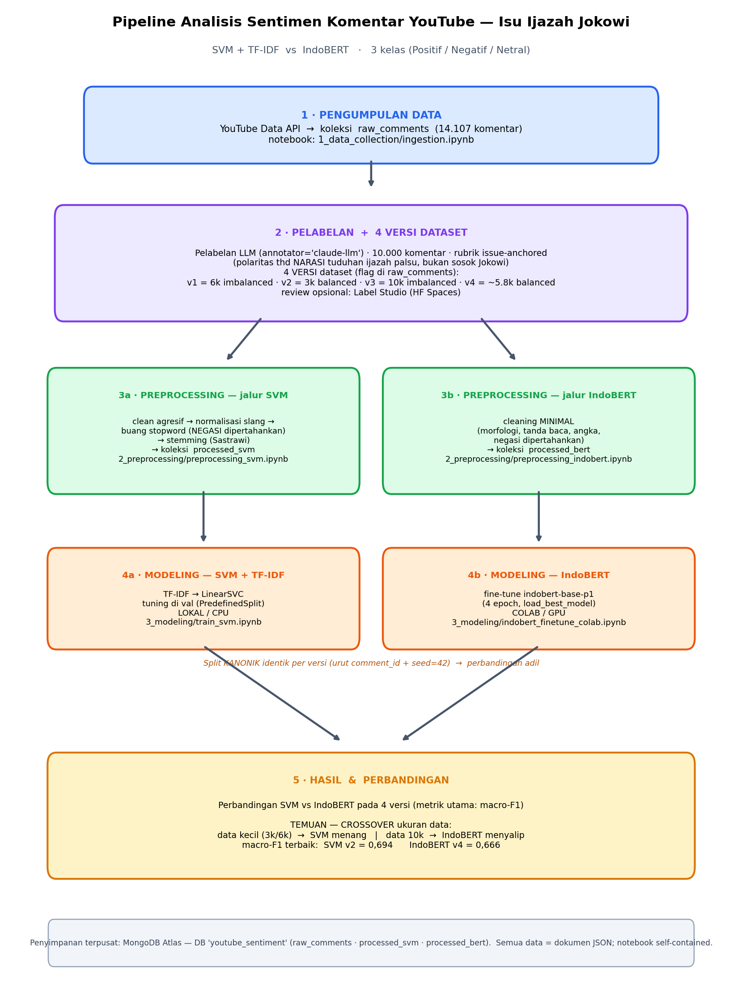
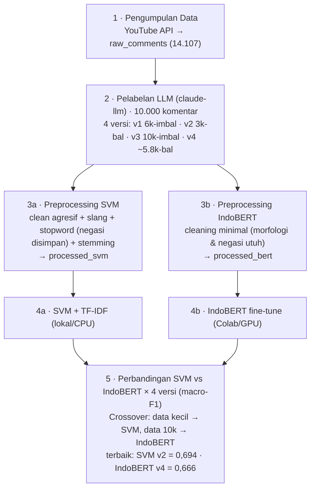

# Analisis Sentimen Komentar YouTube — Isu Ijazah Jokowi

Pipeline end-to-end analisis sentimen komentar YouTube berbahasa Indonesia seputar
**dugaan ijazah palsu Jokowi**, membandingkan dua model: **SVM + TF-IDF** vs
**IndoBERT**.

**Polaritas di-anchor ke ISU/NARASI TUDUHAN**, bukan ke sosok Jokowi (3 kelas):

| Kelas | Arti |
|-------|------|
| **Positif** (0→ id 2) | mendukung / mempercayai / menguatkan tuduhan ijazah palsu |
| **Negatif** | menolak / membantah / mengkritik narasi tuduhan |
| **Netral** | tidak jelas sikap / bertanya / informasi saja |

> Id kelas (untuk model): `Negatif=0, Netral=1, Positif=2`.

## Empat tahap

```
1. Data collection   YouTube Data API  ─► MongoDB Atlas (raw_comments)
2. Preprocessing     raw_comments      ─► processed_svm / processed_bert
3. Modeling          processed_*       ─► SVM (lokal) & IndoBERT (Colab/GPU)
4. Visualization     hasil + korpus    ─► EDA & perbandingan model
```

Semua data berupa **dokumen JSON di MongoDB Atlas** (DB `youtube_sentiment`) — bukan
file CSV/parquet. Koleksi:

| Koleksi | Isi |
|---------|-----|
| `raw_comments` | komentar mentah (+ field label hasil pelabelan + flag `in_balanced_set`) |
| `ingestion_jobs` | status ingestion per video (resume support) |
| `processed_svm` | teks terpreprocessing jalur SVM (kolom `svm`) + `split` |
| `processed_bert` | teks terpreprocessing jalur IndoBERT (kolom `bert`) + `split` |

## Diagram alur



<details><summary>Versi Mermaid (auto-render di GitHub, mudah diedit)</summary>


Penyimpanan terpusat: **MongoDB Atlas** (DB `youtube_sentiment`). Semua data = dokumen JSON.
</details>

## Pelabelan & versi dataset

Pelabelan **LLM-assisted** (`annotator="claude-llm"`): **10.000 komentar berlabel** di
`raw_comments`. Rubrik: `outputs/labeling/_RUBRIK.md`.

Tersedia **4 versi dataset**, ditandai flag boolean di `raw_comments`:

| Versi | Flag (`raw_comments`) | N | Distribusi (Neg/Net/Pos) |
|-------|------------------------|---|---------------------------|
| v1 — imbalanced 6k | `in_set6k` | 6.000 | 2622 / 1002 / 2376 |
| v2 — balanced 3k | `in_balanced_set` | 3.000 | 1000 / 1000 / 1000 |
| v3 — imbalanced 10k | `in_set10k` | 10.000 | 4100 / 1936 / 3964 |
| v4 — balanced 10k | `in_balanced10k` | 5.808 | 1936 / 1936 / 1936 |

Versi balanced disimpan juga sebagai CSV: `outputs/labeling/balanced_1000.csv` (v2) &
`balanced_10k.csv` (v4). Notebook preprocessing saat ini memakai **v2**
(`in_balanced_set`); ganti filter query untuk memakai versi lain.

> Catatan metodologi: ini label LLM (bukan gold-standard manusia) — laporkan sebagai
> *LLM-assisted labeling* di skripsi. Netral adalah kelas terlangka & ter-noisy
> (intrinsik low-confidence).

## Notebooks

Dikelompokkan per tahap dalam folder bernomor (file tanpa nomor); detail di
[`notebooks/README.md`](notebooks/README.md).

| Notebook | Tahap | Baca → Tulis |
|----------|-------|--------------|
| `1_data_collection/ingestion.ipynb` | Collection | YouTube API → `raw_comments` |
| `1_data_collection/export_labeling.ipynb` | bridge | `raw_comments` → Label Studio |
| `2_preprocessing/preprocessing_svm.ipynb` | Preprocessing | `raw_comments` → `processed_svm` |
| `2_preprocessing/preprocessing_indobert.ipynb` | Preprocessing | `raw_comments` → `processed_bert` |
| `3_modeling/train_svm.ipynb` | Modeling (lokal) | `processed_svm` → model + metrik |
| `3_modeling/indobert_finetune_colab.ipynb` | Modeling (Colab/GPU) | `processed_bert` → model + metrik |
| `utils/` | utilitas | config / database_maintenance / reset_database |
| `config` / `database_maintenance` / `reset_database` | utilitas | — |

Notebook preprocessing & modeling **self-contained** (tanpa `import src`) → bisa
dijalankan lokal maupun di Google Colab.

## Setup

```bash
python3 -m venv .venv
source .venv/bin/activate          # Windows: .venv\Scripts\activate
pip install -r requirements.txt
cp .env.example .env               # lalu isi MONGO_URI (Atlas) & YOUTUBE_API_KEY
```

`.env` (kunci utama):

```env
YOUTUBE_API_KEY=...
MONGO_URI=mongodb+srv://<user>:<pass>@<cluster>.mongodb.net/?retryWrites=true&w=majority
MONGO_DB_NAME=youtube_sentiment
LABEL_STUDIO_URL=https://raviarnan-jokowi-label-studio.hf.space
```

> Notebook lokal membaca `MONGO_URI` dari `.env`; di Colab diminta via `getpass`.
> Akses Atlas butuh IP masuk **Network Access allowlist** (diatur project owner).

## Hasil modeling (sementara)

| Model | Sumber | macro-F1 (test) | Status |
|-------|--------|-----------------|--------|
| SVM + TF-IDF | `processed_svm` | **0,699** | ✅ selesai (lokal) |
| IndoBERT | `processed_bert` | — | ⏳ jalankan di Colab |

Detail metodologi modeling: [`MODELING.md`](MODELING.md). Artefak: `outputs/reports/`.

## Skema data

**raw_comments** (sesudah pelabelan):
```json
{
  "comment_id": "UgxABC123_xyz", "video_id": "dQw4w9WgXcQ",
  "text": "Semakin terlihat PALSU.", "like_count": 42,
  "published_at": "2025-01-15T10:23:45Z", "source_title": "Judul Video",
  "label": "Positif", "annotator": "claude-llm", "confidence": 0.8,
  "notes": "menguatkan tuduhan", "in_balanced_set": true
}
```

**processed_svm / processed_bert**:
```json
{ "comment_id": "UgxABC123_xyz", "text": "Semakin terlihat PALSU.",
  "svm": "makin lihat palsu", "label": "Positif", "label_id": 2, "split": "train" }
```

## Arsip

Alur lama (Spark + parquet) disimpan di [`archive/`](archive/README.md) untuk
referensi — **bukan bagian pipeline aktif**. Pipeline sekarang pandas + MongoDB
(dataset kecil, Spark tak diperlukan).
