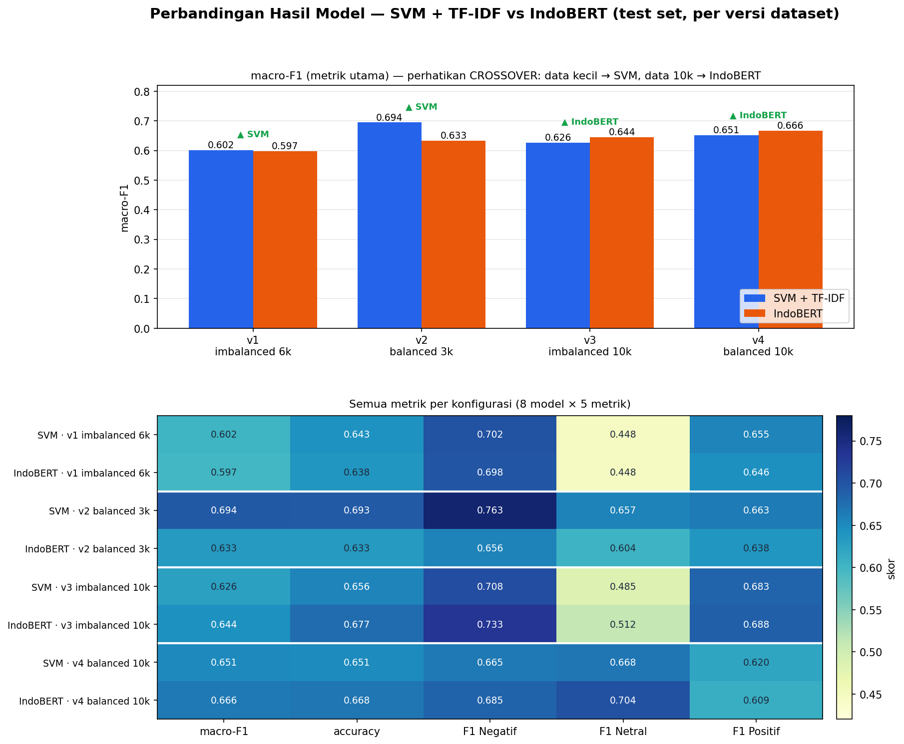

<!-- Render: `npx @marp-team/marp-cli docs/presentation.md -o slides.pdf` (atau --pptx) -->

# Analisis Sentimen Komentar YouTube
## Isu Ijazah Jokowi — SVM + TF-IDF vs IndoBERT

Progress Report
<!-- Nama / NIM / Pembimbing -->

---

## 1. Latar & Masalah

- Komentar YouTube tentang **dugaan ijazah palsu Jokowi**.
- Klasifikasi sentimen **3 kelas**, **di-anchor ke sikap terhadap TUDUHAN** (bukan ke sosok Jokowi):
  - **Positif** = mendukung / percaya tuduhan
  - **Negatif** = membantah / membela
  - **Netral** = tak bersikap / bertanya / OOT
- **Tujuan:** bandingkan **ML klasik (SVM+TF-IDF)** vs **deep learning (IndoBERT)**.

> Keputusan kunci: *issue-anchored polarity* — supaya label konsisten.

---

## 2. Arsitektur & Alur (4 tahap)

Semua data = **dokumen JSON di MongoDB Atlas**.

---

## 3. Data & Pelabelan

- **14.107** komentar di-scrape (YouTube Data API) → MongoDB Atlas.
- **10.000 dilabeli** — *LLM-assisted* (rubrik issue-anchored, konsisten).
- **4 versi dataset** untuk eksperimen:

| Versi | Sifat | N |
|-------|-------|---|
| v1 | imbalanced | 6.000 |
| v2 | **balanced** | 3.000 |
| v3 | imbalanced | 10.000 |
| v4 | **balanced** | ~5.808 |

---

## 4. Preprocessing — 2 jalur berbeda

| | SVM + TF-IDF | IndoBERT |
|---|---|---|
| Strategi | **agresif** | **minimal** |
| Langkah | clean → slang → buang stopword → **stemming** | clean ringan saja |
| Negasi | **dipertahankan** | dipertahankan |
| Alasan | TF-IDF = bag-of-words, butuh sinyal padat | tokenizer & konteks model yang bekerja |

> *"tidak palsu" ≠ "palsu"* → negasi sengaja tidak dibuang.

---

## 5. Hasil Utama

**SVM terbaik (v2): macro-F1 0,694 · IndoBERT terbaik (v4): 0,666**

---

## 6. Temuan Kunci

1. **CROSSOVER ukuran data:** data kecil → **SVM menang**; data 10k → **IndoBERT menyalip**.
   *(Transformer butuh lebih banyak data.)*
2. **Balance > imbalance:** versi imbalanced membuat F1 kelas minoritas (**Netral**) anjlok.
3. **Kualitas > kuantitas:** v2 (3k bersih) mengalahkan v4 (10k lebih noisy).

---

## 7. Eksperimen Peningkatan & Temuan Jujur

- **Cross-validation:** macro-F1 jujur **~0,59–0,62** (single-split 0,694 optimistik) → *evaluation rigor*.
- **Ensemble SVM** (char n-gram + NB + LogReg): **+2–3%**.
- **Relabel konsensus LLM (3-pass): TIDAK menaikkan akurasi.**
  → Plafon ~0,6 = **ambiguitas tugas (Positif↔Netral)**, bukan noise label.
- **Berikutnya:** **IndoBERTweet** (model domain medsos) — hipotesis lever terbesar.

---

## 8. Kesimpulan & Rencana

- **Tidak ada pemenang mutlak** — tergantung data: SVM unggul di data kecil/bersih; IndoBERT di data besar.
- Plafon performa ditentukan **ambiguitas tugas + kualitas label LLM**.
- **Next:** IndoBERTweet · sampel *gold-standard* manusia · augmentasi kelas Netral.

---

## Lampiran — Antisipasi Pertanyaan

- **Kenapa label LLM?** Skala 10k + konsisten; jujur disebut *LLM-assisted*; diuji konsensus 3-pass.
- **Kenapa macro-F1?** 3 kelas; accuracy bias ke mayoritas pada data imbalanced.
- **Kenapa akurasi ~0,6–0,7?** Tugas susah (batas Positif↔Netral, sarkasme/alay); terbukti relabel tak menolong → batas tugas.
- **Kenapa IndoBERT kalah?** Data kecil + domain mismatch (Wikipedia/berita) → rencana IndoBERTweet.
